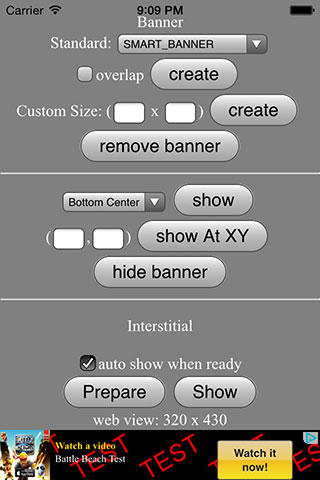

# Cordova Plugin for Flurry Ads #

Present Flurry Ads in Mobile App/Games natively with single line of JavaScript. 

Highlights:
- [x] Easy-to-use APIs. Display Ad with single line of Js code.
- [x] Support Banner, Interstitial Ad, and Video Ad.
- [x] One plugin supports both Android and iOS platform.
- [x] Fixed and overlapped mode.
- [x] Auto fit on orientation change.
- [x] Same API with other RjFun Ad Plugins, easily to switch to other Ad.
- [x] Actively maintained, prompt support.

Compatible with:

* [x] Cordova CLI, v3.5+
* [x] Intel XDK and Crosswalk, r1095+
* [x] IBM Worklight, v6.2+
* [x] Google Mobile Chrome App
* [x] Adobe PhoneGap Build, since 2014/12/9

## How to use? ##

* If use with [Cordova CLI](http://cordova.apache.org/):
```
cordova plugin add com.rjfun.cordova.flurryads
```

* If use with [PhoneGap Buid](http://build.phonegap.com/), just configure in config.xml:
```javascript
<gap:plugin name="com.rjfun.cordova.flurryads" source="plugins.cordova.io"/>
```

* If use with [Intel XDK](https://software.intel.com/en-us/html5/tools):
Project -> CORDOVA 3.X HYBRID MOBILE APP SETTINGS -> PLUGINS AND PERMISSIONS -> Third-Party Plugins ->
Add a Third-Party Plugin -> Get Plugin from the Web, input:
```
Name: FlurryAdsPluginPro
Plugin ID: com.rjfun.cordova.flurryads
[x] Plugin is located in the Apache Cordova Plugins Registry
```

## Quick Start Example Code ##

Step 1: Prepare your Flurry Id for your app, create it in [Flurry Developers website](https://www.flurry.com/)

```javascript
var ad_units = {
	ios : { 
		banner:"2DYY249X5G798HMF3MTH",
		interstitial:"2DYY249X5G798HMF3MTH"
	},
	android : {
		banner:"G56KN4J49YT66CFRD5K6",
		interstitial:"G56KN4J49YT66CFRD5K6"
	}
};

// select the right Ad Id according to platform
var adid = (/(android)/i.test(navigator.userAgent)) ? ad_units.android : ad_units.ios;
```

Step 2: Create a banner with single line of javascript

```javascript
// it will display smart banner at top center, using the default options
if(FlurryAds) FlurryAds.createBanner( adid.banner );
```

Or, show the banner Ad in some other way:

```javascript
// or, show a default banner at bottom
if(FlurryAds) FlurryAds.createBanner( {
	adId: adid.banner, 
	position:FlurryAds.AD_POSITION.BOTTOM_CENTER, 
	autoShow:true} );
```

Step 3: Prepare an interstitial, and show it when needed

```javascript
// preppare and load ad resource in background, e.g. at begining of game level
if(FlurryAds) FlurryAds.prepareInterstitial( {adId:adid.interstitial, autoShow:false} );

// show the interstitial later, e.g. at end of game level
if(FlurryAds) FlurryAds.showInterstitial();
```

Check the example code [test/index.html] (https://github.com/floatinghotpot/cordova-plugin-flurry/blob/master/test/index.html)

## Javascript API Overview ##

Methods:
```javascript
// set default value for other methods
setOptions(options, success, fail);

// for banner
createBanner(adId/options, success, fail);
removeBanner();
showBanner(position);
showBannerAtXY(x, y);
hideBanner();

// for interstitial
prepareInterstitial(adId/options, success, fail);
showInterstitial();
```

## Detailed Documentation ##

The APIs, Events and Options are detailed documented.

Read the detailed API Reference Documentation [English](https://github.com/floatinghotpot/cordova-plugin-flurry/wiki).

## FAQ ##

If encounter problem when using the plugin, please read the [FAQ](https://github.com/floatinghotpot/cordova-plugin-flurry/wiki/FAQ) first.

## Full Example Code ##

This FlurryAds Plugin Pro offers the most flexibility and many options.

Check the [test/index.html] (https://github.com/floatinghotpot/cordova-plugin-fllurry/blob/master/test/index.html).

## Screenshots ##

iPhone Banner | iPhone Interstitial
-----|-----------
 | 

Impressive Video Ad


Ad PluginPro series for the world leading Mobile Ad services:

* [GoogleAds PluginPro](https://github.com/floatinghotpot/cordova-admob-pro), for Google AdMob/DoubleClick.
* [iAd PluginPro](https://github.com/floatinghotpot/cordova-iad-pro), for Apple iAd. 
* [FacebookAds PluginPro](https://github.com/floatinghotpot/cordova-plugin-facebookads), for Facebook Audience Network.
* [FlurryAds PluginPro](https://github.com/floatinghotpot/cordova-plugin-flurry), for Flurry Ads.
* [mMedia PluginPro](https://github.com/floatinghotpot/cordova-plugin-mmedia), for Millennial Meida.
* [MobFox PluginPro](https://github.com/floatinghotpot/cordova-mobfox-pro), for MobFox.
* [MoPub PluginPro](https://github.com/floatinghotpot/cordova-plugin-mopub), for MoPub.

More Cordova/PhoneGap plugins by Raymond Xie, [find them in plugin registry](http://plugins.cordova.io/#/search?search=rjfun).

If use in commercial project or need prompt support, please [buy a license](http://rjfun.github.io/), you will be served with high priority.

Project outsourcing and consulting service is also available. Please [contact us](mailto:rjfun.mobile@gmail.com) if you have the business needs.

