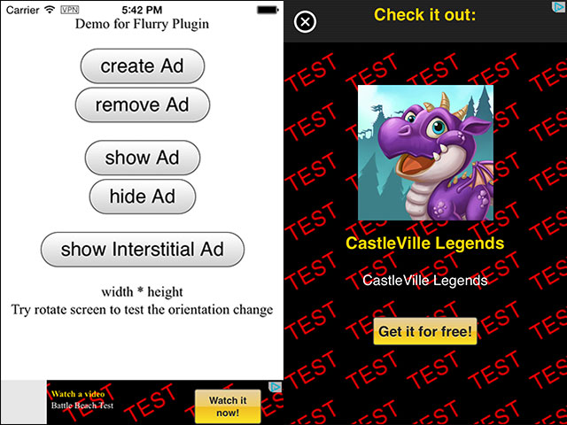
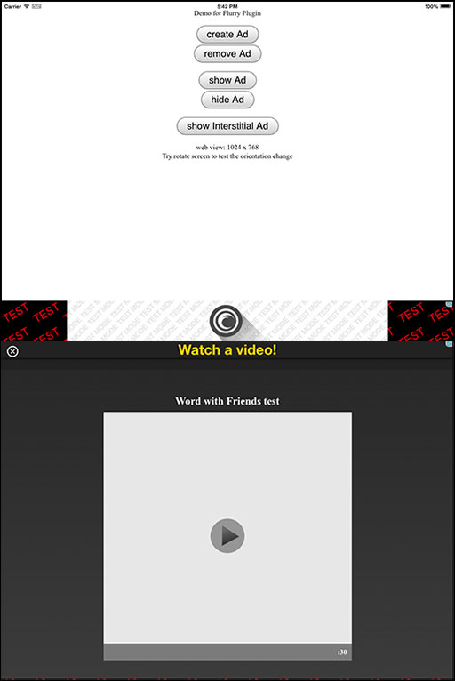

# cordova-plugin-flurry #
=====================

Cordova plugin to support Flurry (analytics and advertisement)

It's targeted to build with cordova 3.5.

Currently, it works on:
* iOS, tested on iphone/ipad iOS7.
* Android, tested on 4.4.

## See Also ##
---------------------------
Besides using Flurry Ad, you have some other options, all working on cordova:
* [cordova-plugin-iad](https://github.com/floatinghotpot/cordova-plugin-iad), Apple iAd service. 
* [cordova-plugin-admob](https://github.com/floatinghotpot/cordova-plugin-admob), Google AdMob service.

## How to use? ##
---------------------------
To install this plugin, follow the [Command-line Interface Guide](http://cordova.apache.org/docs/en/edge/guide_cli_index.md.html#The%20Command-line%20Interface).

    cordova plugin add https://github.com/floatinghotpot/cordova-plugin-flurry.git

Note: ensure you have a proper Flurry account and create an Id for your app.
    
## Quick example with cordova command line tool ##
------------------------------------------------
    cordova create testflurry com.rjfun.testflurry TestFlurry
    cd testflurry
    cordova platform add android
    cordova platform add ios
    cordova plugin add https://github.com/floatinghotpot/cordova-plugin-flurry.git
    rm -r www/*
    cp plugins/com.rjfun.cordova.plugin.flurry/test/index.html www/
    cordova prepare; cordova run android; cordova run ios; 
    ... cordova emulate android/ios, or import the android project into eclipse or ios project into xcode

Or, just clone the testflurry project from github:

    git clone git@github.com:floatinghotpot/testflurry.git
    
## Example javascript  ##
-------------------------------------------------
Call the following code inside onDeviceReady(), because only after device ready you will have the plugin working.
(almost same as cordova-plugin-admob, just plugin name and app key from Ad vendor different)   
 
    var flurry_ios_key = '2DYY249X5G798HMF3MTH';
    var flurry_android_key = 'G56KN4J49YT66CFRD5K6';
    var adId = (navigator.userAgent.indexOf('Android') >=0) ? flurry_android_key : flurry_ios_key;
 
    if( window.plugins && window.plugins.Flurry ) {
        var am = window.plugins.Flurry;
    
        am.createBannerView( 
            {
            'publisherId': adId,
            'adSize': am.AD_SIZE.BANNER,
            'bannerAtTop': false
            }, 
            function() {
        	    am.requestAd(
        		    { 'isTesting':true }, 
            		function(){
            			am.showAd( true );
            		}, 
            		function(){ alert('failed to request ad'); }
            	);
            }, 
            function(){ alert('failed to create banner view'); }
        );
        
        am.createInterstitialView(
              {
                  'publisherId': adId,
              },
              function() {
                  am.requestInterstitialAd( { 'isTesting':true }, function() {
                  }, function() { alert('failed to request ad'); });
              },
              function() {
                  alert("Interstitial failed");
              }
          );
        
    } else {
      alert('Flurry plugin not available/ready.');
    }
 
## More ... ##
 --------------------------------------------------
This plugin also allows you the option to listen for ad events. The following events are supported:

    	// more callback to handle Ad events
    	document.addEventListener('onReceiveAd', function(){
    	});
    	document.addEventListener('onFailedToReceiveAd', function(data){
    		// alert( data.error );
    	});
    	document.addEventListener('onPresentAd', function(){
    	});
    	document.addEventListener('onDismissAd', function(){
    	});
    	document.addEventListener('onLeaveToAd', function(){
    	});   
 
 See the working example code in [demo under test folder](test/index.html)
 
 ## Screenshots, Banner and Interstitial Ads ##
 ---------------------------------------------------
 iPhone
 
 
 
 iPad, Landscape
 
 
 
 Android
 
 
 
 ## Donate ##
----------------------------------------------
You can use this cordova plugin for free. To support this project, donation is welcome.

Donation can be accepted in either of following ways:
* [Donate directly via Paypal](http://floatinghotpot.github.io/#donate)

 
 
